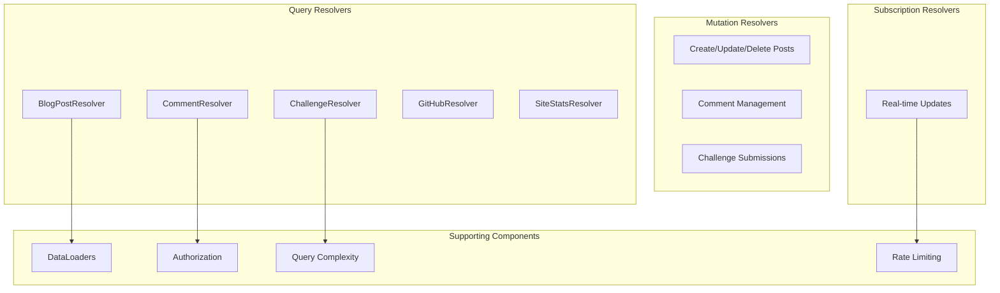

# GraphQL Resolver Documentation

## Overview

This document provides comprehensive documentation for all GraphQL resolvers in the personal website API. Resolvers are organized by domain and include detailed information about their functionality, authorization requirements, and implementation details.

## Resolver Architecture



## BlogPostResolver

Handles all blog post-related queries and mutations.

### File Location
`src/graphql/resolvers/BlogPostResolver.ts`

### Class Definition

```typescript
@Resolver(() => BlogPost)
export class BlogPostResolver {
  constructor(
    private readonly postService: BlogPostService,
    private readonly userLoader: DataLoader<string, User>,
    private readonly tagLoader: DataLoader<string, BlogTag[]>
  ) {}
}
```

### Query Resolvers

#### `posts`
Retrieves paginated list of blog posts with filtering capabilities.

**Signature:**
```typescript
@Query(() => BlogPostConnection)
async posts(
  @Arg('pagination', { nullable: true }) pagination?: PaginationInput,
  @Arg('filters', { nullable: true }) filters?: BlogPostFilters,
  @Ctx() context: Context
): Promise<BlogPostConnection>
```

**Authorization:** Public (filtered by visibility and status)

**Complexity:** Base cost 5 + (limit * 2)

**Implementation Details:**
- Applies automatic filtering for published posts to anonymous users
- Admins and editors can see all posts regardless of status
- Uses database indexes for efficient sorting and filtering
- Implements cursor-based pagination for large datasets

**Database Query Example:**
```sql
SELECT * FROM blog_posts 
WHERE status = 'published' 
  AND visibility = 'public'
  AND ($1::text IS NULL OR title ILIKE $2)
ORDER BY created_at DESC 
LIMIT $3 OFFSET $4;
```

**Usage Example:**
```graphql
query GetPosts {
  posts(
    pagination: { page: 1, limit: 10 }
    filters: { status: PUBLISHED, featured: true }
  ) {
    posts {
      id
      title
      slug
      excerpt
      author {
        username
      }
    }
    total
    hasNextPage
  }
}
```

#### `post`
Retrieves a single blog post by ID or slug.

**Signature:**
```typescript
@Query(() => BlogPost, { nullable: true })
async post(
  @Arg('id', { nullable: true }) id?: string,
  @Arg('slug', { nullable: true }) slug?: string,
  @Ctx() context: Context
): Promise<BlogPost | null>
```

**Authorization:** Public with visibility checks

**Complexity:** Base cost 10

**Implementation Details:**
- Requires either ID or slug parameter
- Increments view count for published posts
- Applies visibility rules based on user role
- Returns null if post not found or not accessible

**Usage Example:**
```graphql
query GetPost($slug: String!) {
  post(slug: $slug) {
    id
    title
    contentHtml
    author {
      username
      avatarUrl
    }
    tags {
      name
      color
    }
  }
}
```

### Mutation Resolvers

#### `createPost`
Creates a new blog post.

**Signature:**
```typescript
@Authorized('editor', 'admin')
@Mutation(() => BlogPost)
async createPost(
  @Arg('input') input: CreateBlogPostInput,
  @Ctx() context: Context
): Promise<BlogPost>
```

**Authorization:** Editor or Admin only

**Complexity:** 20 points

**Implementation Details:**
- Validates input data (title uniqueness, content length)
- Generates URL slug automatically if not provided
- Processes markdown content to HTML
- Creates tag associations
- Publishes real-time notification via subscription

**Validation Rules:**
- Title: 5-200 characters, unique
- Content: Maximum 50,000 characters
- Slug: URL-safe, unique
- Tags: Maximum 10 tags per post

#### `updatePost`
Updates an existing blog post.

**Signature:**
```typescript
@Authorized()
@Mutation(() => BlogPost)
async updatePost(
  @Arg('id') id: string,
  @Arg('input') input: UpdateBlogPostInput,
  @Ctx() context: Context
): Promise<BlogPost>
```

**Authorization:** Post author, editor, or admin

**Implementation Details:**
- Checks ownership or elevated permissions
- Updates only provided fields
- Regenerates HTML content if markdown changed
- Updates modification timestamp
- Publishes update notification

#### `deletePost`
Soft deletes a blog post.

**Signature:**
```typescript
@Authorized('admin')
@Mutation(() => Boolean)
async deletePost(
  @Arg('id') id: string,
  @Ctx() context: Context
): Promise<boolean>
```

**Authorization:** Admin only

**Implementation Details:**
- Performs soft delete (sets status to ARCHIVED)
- Cascades to related comments (status update)
- Removes from search index
- Publishes deletion event

### Field Resolvers

#### `author`
Resolves the author of a blog post using DataLoader.

**Signature:**
```typescript
@FieldResolver(() => User, { nullable: true })
async author(
  @Root() post: BlogPost,
  @Ctx() context: Context
): Promise<User | null>
```

**Implementation:**
```typescript
return this.userLoader.load(post.authorId);
```

#### `tags`
Resolves blog post tags with efficient batching.

**Signature:**
```typescript
@FieldResolver(() => [BlogTag])
async tags(
  @Root() post: BlogPost,
  @Ctx() context: Context
): Promise<BlogTag[]>
```

**Implementation:**
- Uses DataLoader to batch tag queries
- Caches results per request
- Handles many-to-many relationship efficiently

#### `comments`
Resolves post comments with pagination and filtering.

**Signature:**
```typescript
@FieldResolver(() => CommentConnection)
async comments(
  @Root() post: BlogPost,
  @Arg('pagination', { nullable: true }) pagination?: PaginationInput,
  @Arg('filters', { nullable: true }) filters?: CommentFilters,
  @Ctx() context: Context
): Promise<CommentConnection>
```

**Implementation Details:**
- Applies comment status filtering based on user role
- Implements threaded comment loading
- Uses efficient recursive CTE for nested comments

## CommentResolver

Manages comment operations and threading.

### File Location
`src/graphql/resolvers/CommentResolver.ts`

### Query Resolvers

#### `comments`
Retrieves paginated comments with threading support.

**Signature:**
```typescript
@Query(() => CommentConnection)
async comments(
  @Arg('filters', { nullable: true }) filters?: CommentFilters,
  @Arg('pagination', { nullable: true }) pagination?: PaginationInput,
  @Ctx() context: Context
): Promise<CommentConnection>
```

**Authorization:** Public (filtered by status)

**Implementation Details:**
- Supports flat and threaded comment retrieval
- Applies moderation filtering
- Implements depth-limited recursion
- Uses efficient SQL queries with CTEs

**Threaded Comments Query:**
```sql
WITH RECURSIVE comment_tree AS (
  -- Base case: top-level comments
  SELECT *, 0 as depth 
  FROM comments 
  WHERE post_id = $1 AND parent_id IS NULL
  
  UNION ALL
  
  -- Recursive case: replies
  SELECT c.*, ct.depth + 1
  FROM comments c
  JOIN comment_tree ct ON c.parent_id = ct.id
  WHERE ct.depth < 5  -- Max depth limit
)
SELECT * FROM comment_tree ORDER BY created_at;
```

### Mutation Resolvers

#### `addComment`
Adds a new comment to a blog post.

**Signature:**
```typescript
@Mutation(() => Comment)
async addComment(
  @Arg('input') input: CreateCommentInput,
  @Ctx() context: Context
): Promise<Comment>
```

**Authorization:** Public (with rate limiting)

**Implementation Details:**
- Supports both authenticated and guest comments
- Validates parent comment existence for threading
- Applies automatic spam detection
- Sets initial status based on user role and content
- Publishes real-time notification

**Spam Detection:**
- Content analysis for spam patterns
- Rate limiting by IP address
- Honeypot field detection
- User reputation scoring

#### `moderateComment`
Modifies comment status (moderation).

**Signature:**
```typescript
@Authorized('editor', 'admin')
@Mutation(() => Comment)
async moderateComment(
  @Arg('id') id: string,
  @Arg('status') status: CommentStatus,
  @Ctx() context: Context
): Promise<Comment>
```

**Authorization:** Editor or Admin

**Implementation Details:**
- Records moderation action with timestamp
- Updates comment visibility
- Notifies comment author (if registered user)
- Logs moderation action for audit

### Field Resolvers

#### `replies`
Loads nested replies for a comment.

**Signature:**
```typescript
@FieldResolver(() => [Comment])
async replies(
  @Root() comment: Comment,
  @Arg('limit', { nullable: true }) limit?: number,
  @Ctx() context: Context
): Promise<Comment[]>
```

**Implementation:**
- Limits recursion depth to prevent infinite loops
- Uses DataLoader for efficient batching
- Applies same filtering rules as parent comments

## ChallengeResolver

Handles coding challenge operations and submissions.

### File Location
`src/graphql/resolvers/ChallengeResolver.ts`

### Query Resolvers

#### `challenges`
Retrieves paginated coding challenges.

**Signature:**
```typescript
@Query(() => ChallengeConnection)
async challenges(
  @Arg('filters', { nullable: true }) filters?: ChallengeFilters,
  @Arg('pagination', { nullable: true }) pagination?: PaginationInput,
  @Ctx() context: Context
): Promise<ChallengeConnection>
```

**Authorization:** Public

**Implementation Details:**
- Filters inactive challenges for non-admin users
- Supports difficulty and category filtering
- Includes popularity sorting options
- Calculates success rates dynamically

#### `challenge`
Retrieves a single challenge with test cases.

**Signature:**
```typescript
@Query(() => CodingChallenge, { nullable: true })
async challenge(
  @Arg('id', { nullable: true }) id?: string,
  @Arg('slug', { nullable: true }) slug?: string,
  @Ctx() context: Context
): Promise<CodingChallenge | null>
```

**Authorization:** Public

**Implementation Details:**
- Returns sample test cases to all users
- Full test cases visible only to admins
- Tracks challenge view statistics
- Includes user's best submission if authenticated

#### `challengeLeaderboard`
Retrieves leaderboard for a specific challenge.

**Signature:**
```typescript
@Query(() => [LeaderboardEntry])
async challengeLeaderboard(
  @Arg('challengeId') challengeId: string,
  @Arg('limit', { nullable: true }) limit?: number,
  @Ctx() context: Context
): Promise<LeaderboardEntry[]>
```

**Authorization:** Public

**Implementation Details:**
- Orders by best score, then by submission time
- Includes user's rank if authenticated
- Caches results for popular challenges
- Updates periodically with new submissions

### Mutation Resolvers

#### `submitChallenge`
Submits a solution to a coding challenge.

**Signature:**
```typescript
@Authorized()
@Mutation(() => ChallengeSubmission)
async submitChallenge(
  @Arg('input') input: SubmitChallengeInput,
  @Ctx() context: Context
): Promise<ChallengeSubmission>
```

**Authorization:** Authenticated users only

**Implementation Details:**
- Validates code syntax and structure
- Queues submission for asynchronous execution
- Sets initial status to PENDING
- Returns submission ID for tracking
- Publishes status updates via subscription

**Code Execution Pipeline:**
1. Syntax validation
2. Security scanning (no system calls)
3. Queue submission with priority
4. Execute against test cases in sandbox
5. Calculate score and update status
6. Publish results via subscription

#### `createChallenge`
Creates a new coding challenge (admin only).

**Signature:**
```typescript
@Authorized('admin')
@Mutation(() => CodingChallenge)
async createChallenge(
  @Arg('input') input: CreateChallengeInput,
  @Ctx() context: Context
): Promise<CodingChallenge>
```

**Authorization:** Admin only

**Implementation Details:**
- Validates problem statement completeness
- Creates associated test cases
- Generates challenge slug
- Sets up execution environment
- Publishes new challenge notification

## GitHubResolver

Integrates with GitHub API for repository and activity data.

### File Location
`src/graphql/resolvers/GitHubResolver.ts`

### Query Resolvers

#### `githubActivity`
Retrieves comprehensive GitHub activity data.

**Signature:**
```typescript
@Query(() => GitHubActivity)
async githubActivity(
  @Arg('days', { nullable: true }) days?: number,
  @Ctx() context: Context
): Promise<GitHubActivity>
```

**Authorization:** Public

**Complexity:** High (25 points) due to external API calls

**Implementation Details:**
- Caches GitHub API responses (15-minute TTL)
- Aggregates data from multiple endpoints
- Calculates language statistics
- Fetches contribution activity
- Handles API rate limiting gracefully

**GitHub API Integration:**
```typescript
const endpoints = [
  '/user',                    // Profile information
  '/user/repos',              // Repository list
  '/user/repos?affiliation=owner&sort=updated',
  '/users/{username}/events', // Activity events
  '/repos/{owner}/{repo}/languages' // Language stats
];
```

**Caching Strategy:**
- Profile data: 1 hour TTL
- Repository data: 15 minutes TTL
- Activity data: 5 minutes TTL
- Language stats: 30 minutes TTL

### Field Resolvers

#### `repositories`
Resolves user's repositories with statistics.

**Implementation:**
- Filters out private repos for public access
- Sorts by stars, then by update date
- Includes language and topic information
- Calculates activity metrics

#### `languageStats`
Calculates programming language usage statistics.

**Implementation:**
- Aggregates byte counts across repositories
- Calculates percentages
- Applies language color coding
- Excludes configuration and documentation files

## SiteStatsResolver

Provides website analytics and statistics.

### File Location
`src/graphql/resolvers/SiteStatsResolver.ts`

### Query Resolvers

#### `siteStats`
Retrieves general site statistics.

**Signature:**
```typescript
@Query(() => SiteStats)
async siteStats(
  @Ctx() context: Context
): Promise<SiteStats>
```

**Authorization:** Public

**Implementation Details:**
- Aggregates counts from multiple tables
- Caches results for 5 minutes
- Includes engagement metrics
- Calculates growth rates

#### `analyticsOverview`
Provides detailed analytics (admin only).

**Signature:**
```typescript
@Authorized('admin')
@Query(() => AnalyticsOverview)
async analyticsOverview(
  @Arg('days', { nullable: true }) days?: number,
  @Ctx() context: Context
): Promise<AnalyticsOverview>
```

**Authorization:** Admin only

**Implementation Details:**
- Detailed visitor analytics
- Content performance metrics
- User engagement statistics
- Revenue and conversion tracking
- Trend analysis and forecasting

## SubscriptionResolver

Handles real-time subscriptions via WebSocket.

### File Location
`src/graphql/resolvers/SubscriptionResolver.ts`

### Subscription Resolvers

#### `postAdded`
Notifies subscribers of new blog posts.

**Signature:**
```typescript
@Subscription(() => BlogPost, {
  topics: 'POST_ADDED',
  filter: ({ payload, args }) => {
    return args.includeUnpublished || payload.status === 'PUBLISHED';
  }
})
postAdded(
  @Arg('includeUnpublished', { nullable: true }) includeUnpublished?: boolean
): BlogPost
```

**Authorization:** Public (filtered by content visibility)

**Implementation Details:**
- Publishes on post creation/publication
- Filters by post status and visibility
- Includes author and tag information
- Rate limited to prevent spam

#### `commentAdded`
Notifies subscribers of new comments.

**Signature:**
```typescript
@Subscription(() => Comment, {
  topics: 'COMMENT_ADDED',
  filter: ({ payload, args, context }) => {
    return commentVisibilityFilter(payload, args, context);
  }
})
commentAdded(
  @Arg('postId', { nullable: true }) postId?: string,
  @Arg('includePending', { nullable: true }) includePending?: boolean
): Comment
```

**Implementation Details:**
- Publishes on comment approval
- Filters by post ID if specified
- Includes moderation status filtering
- Supports room-based subscriptions per post

#### `submissionUpdated`
Notifies of challenge submission status changes.

**Signature:**
```typescript
@Authorized()
@Subscription(() => ChallengeSubmission, {
  topics: 'SUBMISSION_UPDATED',
  filter: ({ payload, context }) => {
    return payload.userId === context.user?.id;
  }
})
submissionUpdated(
  @Arg('challengeId', { nullable: true }) challengeId?: string
): ChallengeSubmission
```

**Authorization:** User can only see their own submissions

**Implementation Details:**
- Publishes on submission status changes
- Includes execution results and scores
- Filters by challenge ID if specified
- Provides real-time feedback during execution

## Error Handling

### Custom Error Classes

```typescript
export class GraphQLError extends Error {
  constructor(
    message: string,
    public code: string,
    public statusCode: number = 400,
    public extensions?: Record<string, any>
  ) {
    super(message);
  }
}

export class ValidationError extends GraphQLError {
  constructor(message: string, field?: string) {
    super(message, 'VALIDATION_ERROR', 400, { field });
  }
}

export class AuthenticationError extends GraphQLError {
  constructor(message: string = 'Authentication required') {
    super(message, 'UNAUTHENTICATED', 401);
  }
}

export class AuthorizationError extends GraphQLError {
  constructor(message: string = 'Insufficient permissions') {
    super(message, 'FORBIDDEN', 403);
  }
}
```

### Error Handling Middleware

```typescript
export const errorHandler = (error: Error, req: Request, res: Response) => {
  console.error('GraphQL Error:', error);
  
  if (error instanceof GraphQLError) {
    return {
      message: error.message,
      code: error.code,
      extensions: error.extensions
    };
  }
  
  // Don't expose internal errors in production
  if (process.env.NODE_ENV === 'production') {
    return {
      message: 'Internal server error',
      code: 'INTERNAL_ERROR'
    };
  }
  
  return {
    message: error.message,
    code: 'UNKNOWN_ERROR'
  };
};
```

## Performance Optimizations

### DataLoader Implementation

```typescript
export const createUserLoader = () => new DataLoader<string, User>(
  async (userIds: readonly string[]) => {
    const users = await User.findByIds([...userIds]);
    const userMap = new Map(users.map(user => [user.id, user]));
    return userIds.map(id => userMap.get(id) || null);
  },
  {
    cacheKeyFn: (key) => key,
    maxBatchSize: 100,
    batchScheduleFn: (callback) => setTimeout(callback, 10)
  }
);
```

### Query Complexity Analysis

```typescript
const depthLimit = require('graphql-depth-limit');
const costAnalysis = require('graphql-query-complexity').costAnalysisRule;

const complexityLimitRule = costAnalysis({
  maximumComplexity: 1000,
  onComplete: (complexity: number) => {
    console.log('Query complexity:', complexity);
  },
  fieldExtractor: (info: GraphQLResolveInfo) => {
    return info.fieldNodes[0].selectionSet?.selections.length || 1;
  }
});
```

### Caching Strategy

```typescript
const cache = new NodeCache({ stdTTL: 300 }); // 5-minute default TTL

export const cacheResolver = (key: string, ttl?: number) => {
  return (target: any, propertyName: string, descriptor: PropertyDescriptor) => {
    const method = descriptor.value;
    descriptor.value = async function (...args: any[]) {
      const cacheKey = `${key}:${JSON.stringify(args)}`;
      const cached = cache.get(cacheKey);
      
      if (cached) return cached;
      
      const result = await method.apply(this, args);
      cache.set(cacheKey, result, ttl);
      return result;
    };
  };
};
```

## Testing Resolvers

### Unit Testing Example

```typescript
describe('BlogPostResolver', () => {
  let resolver: BlogPostResolver;
  let mockPostService: jest.Mocked<BlogPostService>;
  
  beforeEach(() => {
    mockPostService = createMockPostService();
    resolver = new BlogPostResolver(mockPostService);
  });
  
  describe('posts', () => {
    it('should return paginated posts', async () => {
      const mockPosts = createMockPosts(10);
      mockPostService.findPaginated.mockResolvedValue({
        posts: mockPosts,
        total: 100,
        hasNextPage: true
      });
      
      const result = await resolver.posts(
        { page: 1, limit: 10 },
        { status: PostStatus.PUBLISHED }
      );
      
      expect(result.posts).toHaveLength(10);
      expect(result.total).toBe(100);
      expect(result.hasNextPage).toBe(true);
    });
  });
});
```

### Integration Testing

```typescript
describe('GraphQL Integration', () => {
  let testClient: TestClient;
  
  beforeAll(async () => {
    testClient = await createTestClient();
  });
  
  it('should create and retrieve a blog post', async () => {
    const CREATE_POST = gql`
      mutation CreatePost($input: CreateBlogPostInput!) {
        createPost(input: $input) {
          id
          title
          slug
        }
      }
    `;
    
    const createResult = await testClient.mutate({
      mutation: CREATE_POST,
      variables: {
        input: {
          title: 'Test Post',
          content: 'Test content'
        }
      }
    });
    
    expect(createResult.data.createPost.title).toBe('Test Post');
    
    const GET_POST = gql`
      query GetPost($slug: String!) {
        post(slug: $slug) {
          id
          title
          content
        }
      }
    `;
    
    const getResult = await testClient.query({
      query: GET_POST,
      variables: { slug: createResult.data.createPost.slug }
    });
    
    expect(getResult.data.post.title).toBe('Test Post');
  });
});
```

This resolver documentation provides comprehensive coverage of all GraphQL resolvers, their implementation details, performance considerations, and testing strategies. Each resolver is documented with its authorization requirements, complexity costs, and implementation specifics to help developers understand and maintain the GraphQL API effectively.