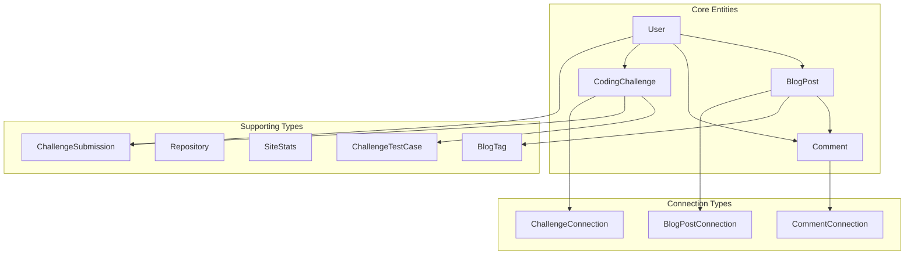

# GraphQL Schema Documentation

## Overview

This document provides detailed documentation for the GraphQL schema, including all types, fields, relationships, and usage examples. The schema is built using TypeGraphQL and follows a domain-driven design approach.

## Schema Architecture



## Type Definitions

### User Type

The User type represents registered users in the system with different roles and permissions.

```graphql
type User {
  # Core Identity
  id: ID!                           # Unique user identifier
  username: String!                 # Unique username (3-50 chars)
  email: String!                    # User's email address
  
  # Profile Information
  firstName: String                 # User's first name
  lastName: String                  # User's last name
  displayName: String               # Computed display name
  bio: String                       # User biography (max 500 chars)
  avatarUrl: String                 # Profile picture URL
  
  # Social Links
  websiteUrl: String                # Personal website
  twitterHandle: String             # Twitter username (without @)
  githubHandle: String              # GitHub username
  linkedinHandle: String            # LinkedIn profile identifier
  
  # System Fields
  role: UserRole!                   # User role (USER, EDITOR, ADMIN)
  isActive: Boolean!                # Account status
  emailVerified: Boolean!           # Email verification status
  lastLoginAt: DateTime             # Last login timestamp
  createdAt: DateTime!              # Account creation date
  updatedAt: DateTime!              # Last profile update
  
  # Relationships
  posts: [BlogPost!]                # User's blog posts
  comments: [Comment!]              # User's comments
  challenges: [CodingChallenge!]    # Created challenges
  submissions: [ChallengeSubmission!] # Challenge submissions
}
```

**UserRole Enum:**
```graphql
enum UserRole {
  USER      # Regular user with basic permissions
  EDITOR    # Can create and edit content
  ADMIN     # Full system access
}
```

**Example Query:**
```graphql
query GetUserProfile($username: String!) {
  userByUsername(username: $username) {
    id
    username
    displayName
    bio
    avatarUrl
    githubHandle
    role
    posts(pagination: { limit: 5 }) {
      posts {
        title
        slug
        publishedAt
      }
    }
    challenges(pagination: { limit: 3 }) {
      challenges {
        title
        difficulty
        successRate
      }
    }
  }
}
```

### BlogPost Type

Represents blog posts with rich content, metadata, and engagement features.

```graphql
type BlogPost {
  # Core Content
  id: ID!                           # Unique post identifier
  authorId: ID!                     # Author's user ID
  title: String!                    # Post title (max 200 chars)
  slug: String!                     # URL-friendly identifier
  excerpt: String                   # Brief post summary
  content: String!                  # Raw content (Markdown)
  contentHtml: String               # Rendered HTML content
  
  # Publishing Status
  status: PostStatus!               # DRAFT, PUBLISHED, ARCHIVED
  visibility: PostVisibility!       # PUBLIC, PRIVATE, UNLISTED
  featured: Boolean!                # Featured post flag
  featuredImageUrl: String          # Hero image URL
  
  # SEO Metadata
  metaTitle: String                 # SEO title override
  metaDescription: String           # Meta description
  metaKeywords: String              # SEO keywords
  
  # Engagement Metrics
  readingTimeMinutes: Int           # Estimated reading time
  viewCount: Int!                   # Total page views
  likeCount: Int!                   # Number of likes
  commentCount: Int!                # Number of comments
  
  # Timestamps
  publishedAt: DateTime             # Publication date
  createdAt: DateTime!              # Creation date
  updatedAt: DateTime!              # Last modification
  
  # Relationships
  author: User                      # Post author
  tags: [BlogTag!]                  # Associated tags
  comments: [Comment!]              # Post comments
  
  # Virtual Fields (computed based on context)
  isLiked: Boolean                  # Whether current user liked this post
  canEdit: Boolean                  # Whether current user can edit
}
```

**PostStatus Enum:**
```graphql
enum PostStatus {
  DRAFT        # Work in progress, not published
  PUBLISHED    # Published and visible
  ARCHIVED     # Archived, not visible in listings
}
```

**PostVisibility Enum:**
```graphql
enum PostVisibility {
  PUBLIC       # Visible to everyone
  PRIVATE      # Only visible to author and admins
  UNLISTED     # Accessible via direct link only
}
```

**BlogTag Type:**
```graphql
type BlogTag {
  id: ID!                           # Unique tag identifier
  name: String!                     # Tag name (unique)
  slug: String!                     # URL-friendly version
  description: String               # Tag description
  color: String                     # Hex color code
  postCount: Int!                   # Number of posts with this tag
  createdAt: DateTime!              # Tag creation date
  updatedAt: DateTime!              # Last update
}
```

**Example Query:**
```graphql
query GetBlogPost($slug: String!) {
  post(slug: $slug) {
    id
    title
    contentHtml
    excerpt
    featuredImageUrl
    readingTimeMinutes
    viewCount
    likeCount
    publishedAt
    isLiked
    author {
      username
      displayName
      avatarUrl
      bio
    }
    tags {
      name
      slug
      color
    }
    comments(pagination: { limit: 10 }) {
      comments {
        id
        content
        likeCount
        createdAt
        author {
          username
          avatarUrl
        }
        replies {
          id
          content
          createdAt
          author {
            username
          }
        }
      }
    }
  }
}
```

### Comment Type

Hierarchical comment system with moderation capabilities.

```graphql
type Comment {
  # Core Content
  id: ID!                           # Unique comment identifier
  postId: ID!                       # Associated post ID
  authorId: ID                      # Author ID (null for guests)
  parentId: ID                      # Parent comment ID (for threading)
  content: String!                  # Comment content
  contentHtml: String               # Rendered HTML
  
  # Status & Moderation
  status: CommentStatus!            # PENDING, APPROVED, REJECTED, SPAM
  isGuest: Boolean!                 # Guest comment flag
  guestName: String                 # Guest author name
  guestEmail: String                # Guest email (not exposed)
  
  # System Information
  ipAddress: String                 # IP address (admin only)
  userAgent: String                 # User agent (admin only)
  
  # Engagement
  likeCount: Int!                   # Number of likes
  replyCount: Int!                  # Number of direct replies
  depth: Int!                       # Threading depth level
  
  # Moderation Info
  approvedAt: DateTime              # Approval timestamp
  approvedBy: String                # Moderator username
  
  # Timestamps
  createdAt: DateTime!              # Comment creation
  updatedAt: DateTime!              # Last modification
  
  # Relationships
  author: User                      # Comment author (if registered)
  parent: Comment                   # Parent comment
  replies: [Comment!]               # Child comments
  post: BlogPost!                   # Associated blog post
}
```

**CommentStatus Enum:**
```graphql
enum CommentStatus {
  PENDING      # Awaiting moderation
  APPROVED     # Approved and visible
  REJECTED     # Rejected by moderator
  SPAM         # Marked as spam
}
```

**Example Query:**
```graphql
query GetPostComments($postId: ID!, $pagination: PaginationInput) {
  comments(
    filters: { postId: $postId, status: APPROVED }
    pagination: $pagination
  ) {
    comments {
      id
      content
      contentHtml
      likeCount
      replyCount
      depth
      createdAt
      author {
        username
        avatarUrl
      }
      parent {
        id
        author {
          username
        }
      }
      replies(limit: 3) {
        id
        content
        createdAt
        author {
          username
          avatarUrl
        }
      }
    }
    total
    hasNextPage
  }
}
```

### CodingChallenge Type

Programming challenges with test cases and submission tracking.

```graphql
type CodingChallenge {
  # Basic Information
  id: ID!                           # Unique challenge identifier
  authorId: ID!                     # Challenge creator ID
  title: String!                    # Challenge title
  slug: String!                     # URL-friendly identifier
  description: String               # Brief description
  problemStatement: String!         # Detailed problem description
  
  # Classification
  difficulty: ChallengeDifficulty!  # EASY, MEDIUM, HARD, EXPERT
  category: String!                 # Problem category
  tags: [String!]!                  # Problem tags/topics
  
  # Problem Specification
  inputFormat: String               # Input format description
  outputFormat: String              # Output format description
  constraints: String               # Problem constraints
  sampleInput: String               # Example input
  sampleOutput: String              # Example output
  explanation: String               # Solution explanation
  hints: [String!]                  # Helpful hints
  
  # Execution Limits
  timeLimitMs: Int!                 # Time limit in milliseconds
  memoryLimitMb: Int!               # Memory limit in MB
  
  # Statistics
  submissionCount: Int!             # Total submissions
  solvedCount: Int!                 # Successful solutions
  successRate: Float!               # Success percentage
  
  # Status
  isFeatured: Boolean!              # Featured challenge flag
  isActive: Boolean!                # Active/disabled status
  
  # Timestamps
  createdAt: DateTime!              # Challenge creation
  updatedAt: DateTime!              # Last modification
  
  # Relationships
  author: User!                     # Challenge creator
  testCases: [ChallengeTestCase!]   # Test cases
  submissions: [ChallengeSubmission!] # User submissions
}
```

**ChallengeDifficulty Enum:**
```graphql
enum ChallengeDifficulty {
  EASY         # Beginner level
  MEDIUM       # Intermediate level  
  HARD         # Advanced level
  EXPERT       # Expert level
}
```

**ChallengeTestCase Type:**
```graphql
type ChallengeTestCase {
  id: ID!                           # Test case identifier
  challengeId: ID!                  # Associated challenge
  inputData: String!                # Test input
  expectedOutput: String!           # Expected result
  isSample: Boolean!                # Sample test case flag
  explanation: String               # Test case explanation
  timeoutMs: Int                    # Custom timeout
  memoryLimitMb: Int                # Custom memory limit
  createdAt: DateTime!              # Creation timestamp
}
```

**ChallengeSubmission Type:**
```graphql
type ChallengeSubmission {
  id: ID!                           # Submission identifier
  challengeId: ID!                  # Challenge ID
  userId: ID!                       # Submitter ID
  language: String!                 # Programming language
  code: String!                     # Submitted code
  status: SubmissionStatus!         # Execution status
  score: Float                      # Submission score (0-100)
  executionTimeMs: Int              # Execution time
  memoryUsageMb: Float              # Memory usage
  testCasesPassed: Int!             # Passed test cases
  testCasesTotal: Int!              # Total test cases
  errorMessage: String              # Error details
  submittedAt: DateTime!            # Submission time
  judgedAt: DateTime                # Judging completion time
  
  # Relationships
  challenge: CodingChallenge!       # Associated challenge
  user: User!                       # Submitter
}
```

**SubmissionStatus Enum:**
```graphql
enum SubmissionStatus {
  PENDING      # Queued for execution
  RUNNING      # Currently executing
  ACCEPTED     # All test cases passed
  WRONG_ANSWER # Incorrect output
  TIME_LIMIT   # Execution timeout
  MEMORY_LIMIT # Memory exceeded
  RUNTIME_ERROR # Runtime exception
  COMPILE_ERROR # Compilation failed
  SYSTEM_ERROR # System error
}
```

**Example Query:**
```graphql
query GetChallenge($slug: String!) {
  challenge(slug: $slug) {
    id
    title
    description
    problemStatement
    difficulty
    category
    tags
    inputFormat
    outputFormat
    constraints
    sampleInput
    sampleOutput
    explanation
    hints
    timeLimitMs
    memoryLimitMb
    submissionCount
    solvedCount
    successRate
    author {
      username
    }
    testCases(isSample: true) {
      inputData
      expectedOutput
      explanation
    }
  }
}
```

### Repository Type

GitHub repository integration for showcasing projects.

```graphql
type Repository {
  # Basic Information
  id: ID!                           # GitHub repository ID
  name: String!                     # Repository name
  fullName: String!                 # owner/repository
  description: String               # Repository description
  
  # URLs
  htmlUrl: String!                  # GitHub page URL
  cloneUrl: String!                 # Git clone URL
  
  # Statistics
  language: String                  # Primary language
  stargazersCount: Int!             # Star count
  forksCount: Int!                  # Fork count
  size: Int!                        # Repository size (KB)
  
  # Metadata
  topics: [String!]!                # Repository topics/tags
  isPrivate: Boolean!               # Private repository flag
  isFork: Boolean!                  # Fork flag
  isArchived: Boolean!              # Archived flag
  
  # Timestamps
  createdAt: DateTime!              # Repository creation
  updatedAt: DateTime!              # Last update
  pushedAt: DateTime                # Last push
}
```

### Connection Types

Connection types provide pagination information for list queries.

```graphql
type BlogPostConnection {
  posts: [BlogPost!]!               # List of blog posts
  total: Int!                       # Total count
  page: Int!                        # Current page
  limit: Int!                       # Items per page
  hasNextPage: Boolean!             # More pages available
  hasPreviousPage: Boolean!         # Previous pages available
}

type CommentConnection {
  comments: [Comment!]!             # List of comments
  total: Int!                       # Total count
  hasNextPage: Boolean!             # More pages available
}

type ChallengeConnection {
  challenges: [CodingChallenge!]!   # List of challenges
  total: Int!                       # Total count
  hasNextPage: Boolean!             # More pages available
}
```

## Input Types

### Pagination Input

Standard pagination parameters used across queries.

```graphql
input PaginationInput {
  page: Int = 1                     # Page number (1-based)
  limit: Int = 20                   # Items per page (max 100)
  sortBy: String = "createdAt"      # Sort field
  sortOrder: SortOrder = DESC       # Sort direction
}

enum SortOrder {
  ASC                               # Ascending order
  DESC                              # Descending order
}
```

### Filter Inputs

#### BlogPostFilters
```graphql
input BlogPostFilters {
  status: PostStatus                # Filter by status
  visibility: PostVisibility        # Filter by visibility
  featured: Boolean                 # Featured posts only
  authorId: ID                      # Posts by specific author
  tags: [String!]                   # Posts with specific tags
  search: String                    # Full-text search
  dateFrom: DateTime                # Posts after date
  dateTo: DateTime                  # Posts before date
}
```

#### CommentFilters
```graphql
input CommentFilters {
  postId: ID                        # Comments on specific post
  authorId: ID                      # Comments by specific author
  status: CommentStatus             # Filter by status
  parentId: ID                      # Direct replies to comment
  includeReplies: Boolean = false   # Include nested replies
  search: String                    # Search comment content
}
```

#### ChallengeFilters
```graphql
input ChallengeFilters {
  difficulty: ChallengeDifficulty   # Filter by difficulty
  category: String                  # Filter by category
  tags: [String!]                   # Filter by tags
  isFeatured: Boolean               # Featured challenges only
  isActive: Boolean = true          # Active challenges only
  authorId: ID                      # Challenges by author
  search: String                    # Search title/description
}
```

### Create/Update Inputs

#### CreateBlogPostInput
```graphql
input CreateBlogPostInput {
  title: String!                    # Post title (required)
  content: String!                  # Post content (required)
  excerpt: String                   # Brief summary
  status: PostStatus = DRAFT        # Initial status
  visibility: PostVisibility = PUBLIC # Visibility setting
  featured: Boolean = false         # Featured flag
  featuredImageUrl: String          # Hero image
  metaTitle: String                 # SEO title
  metaDescription: String           # Meta description
  tags: [String!]                   # Tag names
}
```

#### CreateCommentInput
```graphql
input CreateCommentInput {
  postId: ID!                       # Target post (required)
  content: String!                  # Comment content (required)
  parentId: ID                      # Parent for threading
  guestName: String                 # Guest author name
  guestEmail: String                # Guest email
}
```

#### SubmitChallengeInput
```graphql
input SubmitChallengeInput {
  challengeId: ID!                  # Challenge ID (required)
  language: String!                 # Programming language
  code: String!                     # Solution code
}
```

## Advanced Schema Features

### Union Types

```graphql
union SearchResult = BlogPost | CodingChallenge | User

type Query {
  search(query: String!, type: SearchType): [SearchResult!]!
}

enum SearchType {
  ALL
  POSTS
  CHALLENGES
  USERS
}
```

### Interface Types

```graphql
interface Node {
  id: ID!
}

interface Timestamped {
  createdAt: DateTime!
  updatedAt: DateTime!
}

type BlogPost implements Node & Timestamped {
  id: ID!
  createdAt: DateTime!
  updatedAt: DateTime!
  # ... other fields
}
```

### Custom Scalars

```graphql
scalar DateTime              # ISO 8601 datetime string
scalar Email                 # Valid email address
scalar URL                   # Valid URL string
scalar Slug                  # URL-friendly string
scalar Markdown              # Markdown content
scalar HTML                  # HTML content
scalar JSON                  # JSON object
```

## Schema Validation Rules

### Field Constraints

- **String lengths**: Most text fields have maximum length constraints
- **Email validation**: Email fields validate format
- **URL validation**: URL fields validate proper format
- **Slug validation**: Slugs must be URL-safe
- **Content sanitization**: HTML content is sanitized

### Business Logic Validation

- **Unique constraints**: Usernames, emails, and slugs must be unique
- **Role permissions**: Operations checked against user roles
- **Comment threading**: Maximum depth limits prevent infinite nesting
- **Content moderation**: Automated spam detection for comments

### Rate Limiting Schema

```graphql
directive @rateLimit(
  max: Int!
  window: String!
  message: String
  identityArgs: [String]
  arrayLengthField: String
) on FIELD_DEFINITION

type Query {
  posts: BlogPostConnection! @rateLimit(max: 100, window: "1m")
  search(query: String!): [SearchResult!]! @rateLimit(max: 10, window: "1m")
}
```

## Schema Evolution

### Deprecation Strategy

```graphql
type BlogPost {
  oldField: String @deprecated(reason: "Use newField instead")
  newField: String
}
```

### Versioning Approach

- **Additive changes**: New fields and types can be added safely
- **Breaking changes**: Deprecated fields maintained for backward compatibility
- **Field evolution**: Use nullable fields for new requirements
- **Schema documentation**: All changes documented with rationale

## Performance Considerations

### Query Complexity

Each field has an assigned complexity cost to prevent resource abuse:

```graphql
type Query {
  posts(limit: Int = 20): BlogPostConnection! 
  # Complexity: base cost (5) + (limit * 2)
  
  comments(postId: ID!, includeReplies: Boolean = false): CommentConnection!
  # Complexity: base cost (3) + conditional cost for replies (10)
}
```

### DataLoader Integration

Schema designed to work with DataLoader pattern:

- Batch loading by ID for all entity types
- N+1 query prevention for relationships
- Request-scoped caching

### Caching Strategies

- **Query result caching**: Expensive queries cached with TTL
- **Field-level caching**: Individual field results cached
- **Cache invalidation**: Automatic invalidation on mutations

This schema provides a robust foundation for the personal website's GraphQL API, with strong typing, comprehensive documentation, and performance optimizations built in.